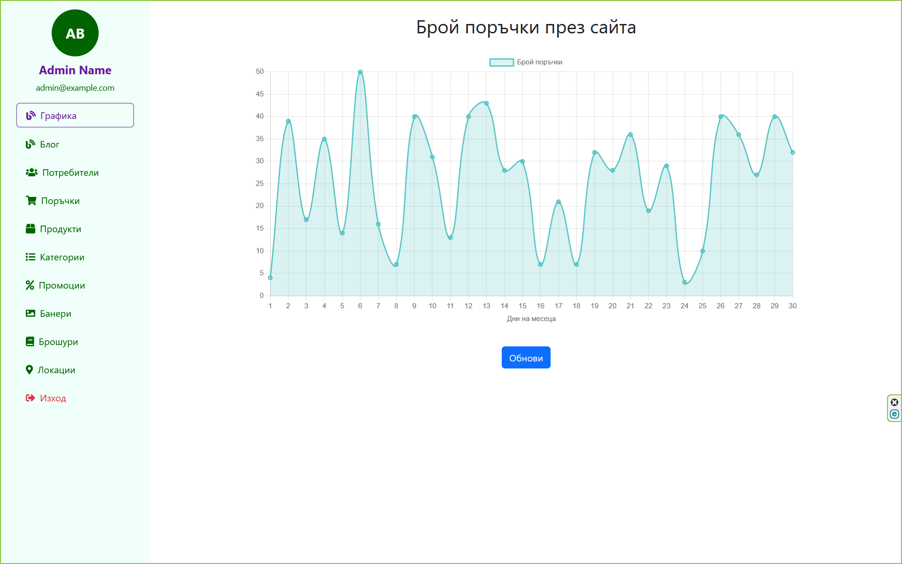

# SidikaPharm-WebApp - Spring MVC
Представлява **Web-based E-commerce** приложение ,с което предоставяме възможност на клиентите да разглеждат и следят цените на лекарствата,да се консултират със специалист и да правят поръчки за доставка на необходимите лекарства.

## Tech Stack:
- Java
- MySQL
- Spring Boot &nbsp;&nbsp;&nbsp;&nbsp;&nbsp;&nbsp;&nbsp;&nbsp;&nbsp;&nbsp;&nbsp;&nbsp;&nbsp;&nbsp;&nbsp;&nbsp;&nbsp;&nbsp;&nbsp;&nbsp; - Spring DataJPA&nbsp;&nbsp;&nbsp;&nbsp;&nbsp;&nbsp;&nbsp;&nbsp;&nbsp;&nbsp;&nbsp;&nbsp;&nbsp;&nbsp;&nbsp;&nbsp;&nbsp;&nbsp;&nbsp;&nbsp; - Spring Security

- JavaScript
- Thymeleaf
- HTML
- CSS
- Bootstrap

  
*Всички останали зависимости и библиотеки могат да се видят в `build.gradle.kts` файла.*

## Конфигурация за стартиране
  ### Външни APIs
  *в процес на разработване ..*
  ### Вътрешни APIs
  *в процес на разработване ..*
  ### Environment Variables :
  ...
  ### Конфигурация за базата данни
  ...
  ### Конфигурация за автоматичното изпращане на имейли
  *в процес на разработване ..*
# За Проекта    

  ## Homepage
  

Това е popup прозорец с който можете да преглеждате и добавяте коментари към дадена статия/новина.

## Login/Registration page

## User Profile

## User Cart

## Admin Panel

